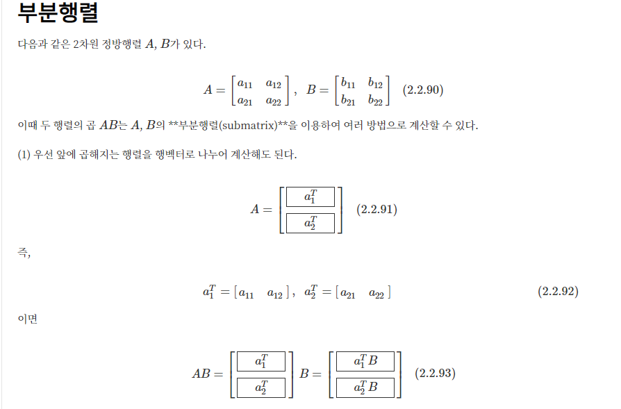
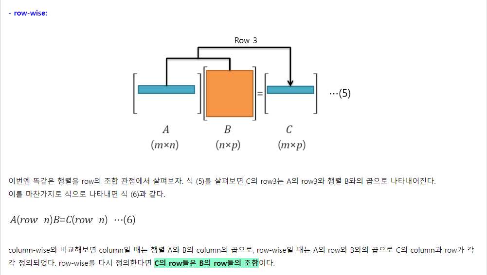
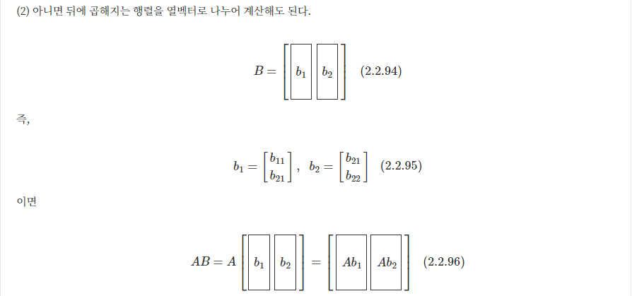
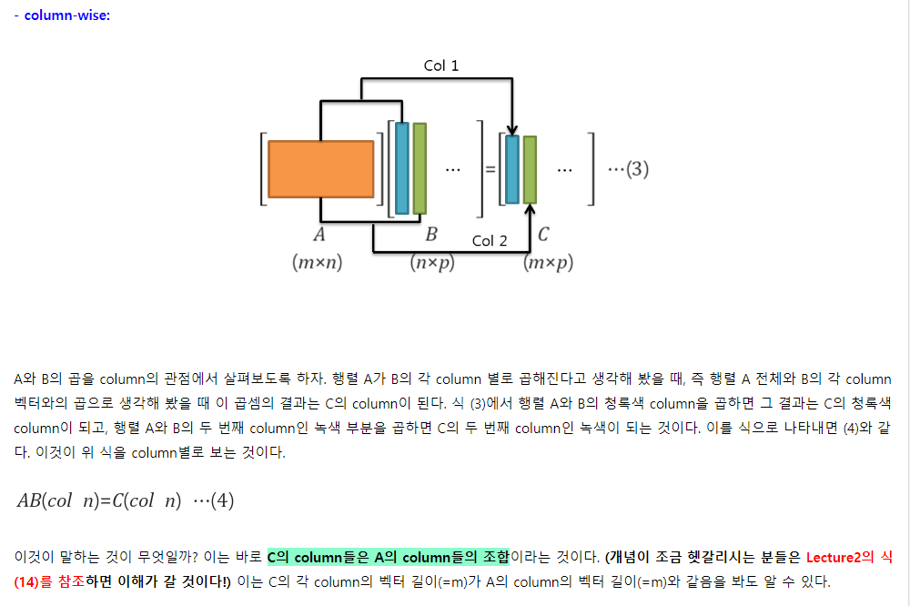
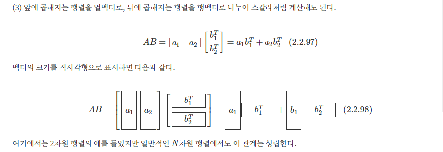
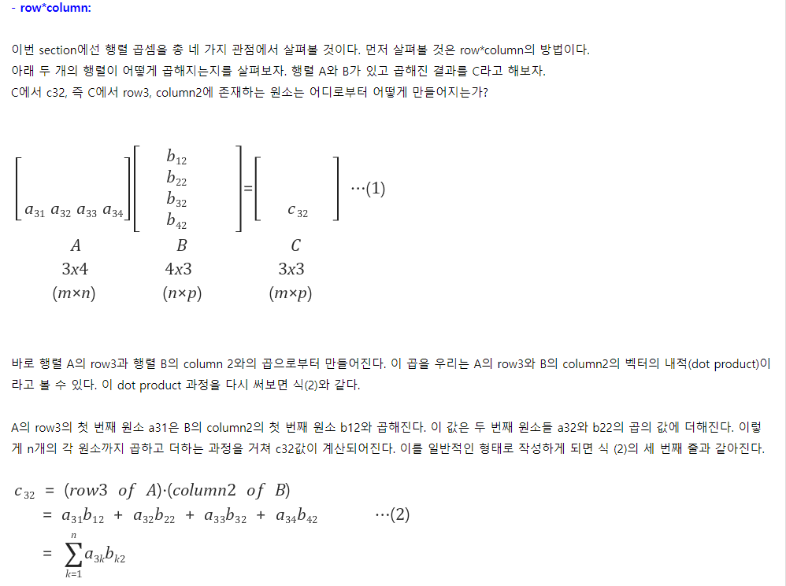

# Matrix multiplication

## Row-wise

## Column-wise

## Outer product

## Dot product

# Reference

데이터싸이언스스쿨

런어게인 https://twlab.tistory.com/

##  Linear Algebra for Data Science with examples in R 

https://shainarace.github.io/LinearAlgebra/